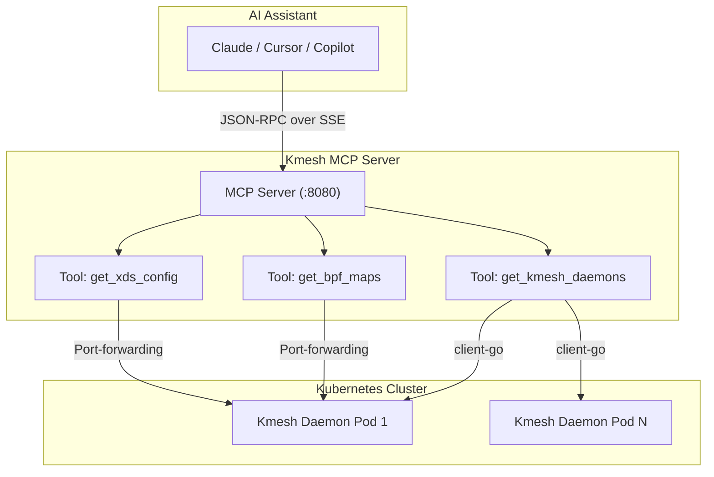

## Proposal for AI-Native Kmesh Service Mesh Management via MCP Server

Upstream issue: <https://github.com/kmesh-net/kmesh/issues/1800>

### Summary

- **The Problem:** Right now, diagnosing issues within the Kmesh data plane requires users to navigate complex `kmeshctl` commands, understand low-level eBPF internals, and parse through large xDS configuration dumps. This manual workflow creates a steep learning curve and diverts developer focus away from core tasks.
- **The Solution:** This proposal introduces an **MCP (Model Context Protocol) Server** specifically tailored for Kmesh. It acts as an intermediary translator that exposes Kmesh's internal capabilities as standardized tools, allowing AI assistants (like Claude, Cursor, or GitHub Copilot) to interact directly with the service mesh.
- **The Goal:** To enable natural language observability. Instead of manually correlating pod IPs and routing tables, users can ask high-level questions (e.g., "Why is service A failing to reach service B?"). The AI will autonomously fetch, filter, and analyze the required data from Kmesh to provide an immediate root-cause analysis.

### Motivation

- Service meshes are inherently complex, and Kmesh's high-performance eBPF-based architecture means debugging often involves kernel-level data. When developers encounter issues, manually fetching data from eBPF maps and parsing massive JSON payloads is tedious.
- By integrating an AI-native MCP server, we dramatically reduce the Mean Time To Resolution (MTTR) for debugging. The AI can autonomously chain tools—finding the right pods, extracting internal data, and synthesizing the results—all in the background.
- Automating this context-gathering phase empowers both novice and experienced users to interact with Kmesh more intuitively, without sacrificing the security or performance of the data plane.

#### Goals

- Build a standalone Go-based MCP Server (v1.0+ compliant) utilizing HTTP/SSE (Server-Sent Events) transport.
- Develop 10 primary data-fetching tools for AI context resolution (e.g., `get_version`, `list_daemon_pods`, `config_dump`, `get_bpf_maps`).
- Ensure secure internal API wiring by reusing Kmesh's built-in secure port-forwarding logic, avoiding any exposure of internal endpoints (`localhost:15200`) to the external network.
- Achieve >80% unit test coverage, alongside integration tests and end-to-end smoke tests using mock LLM clients.
- Provide comprehensive, beginner-friendly documentation and AI client setup guides.

#### Non-Goals

- Modifying the core eBPF data plane or introducing new networking paradigms into Kmesh.
- Exposing mutating operations (e.g., updating configurations or deleting pods). The initial release will strictly enforce a **Read-Only** boundary to guarantee cluster safety.

### Kmesh CodeBase Analysis & Integration Points

To seamlessly integrate the MCP server, we will interact with specific components of the existing Kmesh architecture:

1. **Kmesh Daemon (`daemon/`)**: The core process running as a DaemonSet. The MCP server will query the daemon to understand the lifecycle and current state.
2. **eBPF Data Plane (`bpf/`)**: The heart of Kmesh. The server will fetch states of both Kernel-Native Mode and Dual-Engine Mode by extracting data from eBPF maps.
3. **Status Server (`pkg/status/`)**: The internal HTTP server listening on `localhost:15200`. This will be our primary data source. The MCP tools will securely route requests to endpoints like `/version`, `/debug/config_dump`, and `/authz`.
4. **CLI Utilities (`ctl/`)**: The MCP server will reuse the robust `setupPortForward` logic found in `kmeshctl` to securely tunnel requests into the daemon pods without exposing new Kubernetes services.

### Proposal Details

#### 1. AI Tool Chaining & Context Flow

Unlike a traditional UI, an MCP server empowers the AI to independently navigate the infrastructure using **Tool Chaining**.

**The Two-Step AI Workflow:**

1. **Cluster Discovery:** The AI uses a tool (e.g., `list_daemon_pods`) to identify all active `kmesh-daemon` instances.
2. **Deep Inspection:** The AI passes the discovered `podName` as an argument into subsequent tools (e.g., `get_bpf_maps` or `get_xds_config`) to extract node-specific routing data.

Because the tools are interconnected, the AI can drill down from a cluster-wide view to a specific kernel map entirely on its own.

**Architecture Diagram:**

#### 2. Technical Implementation Blueprint

The development of each tool follows a strict pipeline ensuring type safety, security, and LLM context optimization.

**A. Data Model & Initialization:**
We will define Go structs decorated with `jsonschema` tags. The `mcp-go` SDK automatically parses these to generate the exact prompt instructions the LLM requires.

**B. Secure API Wiring (Port-Forwarding):**
To fetch data without compromising security, we will implement a secure tunnel mechanism directly mimicking `kmeshctl`.
*Workflow:* The server dynamically locates the daemon pod using `client-go` -> Sets up a secure port-forward tunnel to `15200` -> Executes the HTTP GET request -> Closes the tunnel.

**C. Data Formatting & Noise Reduction:**
Raw xDS and eBPF dumps can easily exceed an LLM's context window. The MCP server will aggressively parse and filter JSON payloads, stripping irrelevant boilerplate before packaging the response into a `CallToolResult`.

**D. Tool Registration:**
The filtered tool handlers are bound to the SSE transport server, instantly broadcasting their availability to connected AI clients.

**Development Lifecycle Diagram:**

```mermaid
flowchart TB
    Start(["Start Development"]) --> Phase1
    
    subgraph Phase1 ["Phase 1: Implementation & Integration"]
        direction TB
        
        subgraph Step1 ["Step 1: Data Model"]
            direction TB
            a1["Define Go structs with jsonschema tags"] --> a2["Configure properties like pod names"]
        end
        
        subgraph Step2 ["Step 2: API Wiring"]
            direction TB
            b1["Dynamically locate active daemon pods"] --> b2["Set up secure port-forward to daemon"] --> b3["Make HTTP GET requests"]
        end
        
        subgraph Step3 ["Step 3: Data Formatting"]
            direction TB
            c1["Parse JSON payloads"] --> c2["Filter irrelevant noise"] --> c3["Package into CallToolResult"]
        end
        
        subgraph Step4 ["Step 4: Tool Registration"]
            direction TB
            d1["Call mcp.AddTool"] --> d2["Provide clear name and description"]
        end
        
        Step1 --> Step2 --> Step3 --> Step4
    end

    Phase1 --> Phase2

    subgraph Phase2 ["Phase 2: Testing & Deployment"]
        direction TB
        
        subgraph Step5 ["Step 5: Error Handling"]
            direction TB
            e1["Implement context timeouts"] --> e2["Catch network errors"]
        end
        
        subgraph Step6 ["Step 6: Security Checks"]
            direction TB
            f1["Enforce read-only requests"] --> f2["Sanitize AI input parameters"]
        end
        
        subgraph Step7 ["Step 7: Unit Testing"]
            direction TB
            g1["Use client-go fake clients"] --> g2["Mock HTTP responses"]
        end
        
        subgraph Step8 ["Step 8: Quality Assurance"]
            direction TB
            h1["Deploy Kmesh test environment"] --> h2["Connect Claude/Cursor for E2E testing"]
        end
        
        Step5 --> Step6 --> Step7 --> Step8
    end
    
    Phase2 --> Finish(["Tool Implementation Complete"])
```

### Implementation Timeline (12 Weeks)

The project execution is divided into 5 distinct phases over a 12-week period:

- **Phase 1: Environment Setup & Core Server Foundation (Weeks 1-2)**
  - Establish a local Kubernetes test cluster (Kind/Minikube) and deploy Kmesh.
  - Scaffold the Go-based MCP server using the official `mark3labs/mcp-go` SDK.
  - Implement the HTTP + SSE transport layer and validate internal API wiring (port-forwarding).

- **Phase 2: Core Tool Implementation (Weeks 3-5)**
  - Build cluster discovery tools: `get_version`, `list_daemon_pods`, and `get_daemon_health`.
  - Build Status Server tools: `config_dump`, `get_bpf_maps`, `get_logger_levels`, and `get_authz_status`.
  - Build K8s API tools: `list_waypoints`, `get_waypoint_status`, and `get_mesh_namespaces`.

- **Phase 3: AI Orchestration & Testing (Weeks 6-8)**
  - Implement robust error handling to gracefully catch malformed AI inputs.
  - Write unit tests for all 10 core tools utilizing mocked HTTP responses (Target: >80% coverage).
  - Locally connect Claude Desktop / Cursor to validate Tool Chaining and refine JSON schemas for better AI prompt understanding.

- **Phase 4: Testing & Quality Assurance (Weeks 9-10)**
  - Develop 5 additional stretch tools (e.g., IPsec status, connectivity diagnosis).
  - Implement the `kmeshctl mcp serve` Cobra subcommand for seamless CLI integration.
  - Execute end-to-end smoke tests to validate that the SSE transport server correctly streams JSON-RPC responses.

- **Phase 5: Documentation & Final Delivery (Weeks 11-12)**
  - Create comprehensive user and developer guides, including setup instructions for various AI clients.
  - Produce a demo video showcasing an AI autonomously debugging a complex Kmesh routing issue.
  - Publish a detailed blog post on `kmesh.net` and package the server for upstream distribution.
