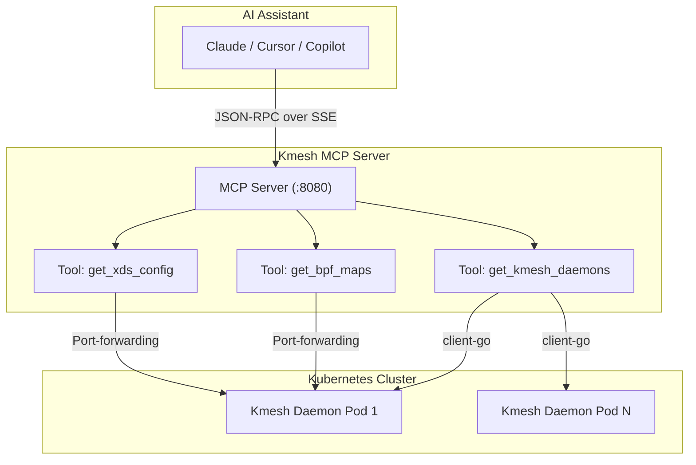
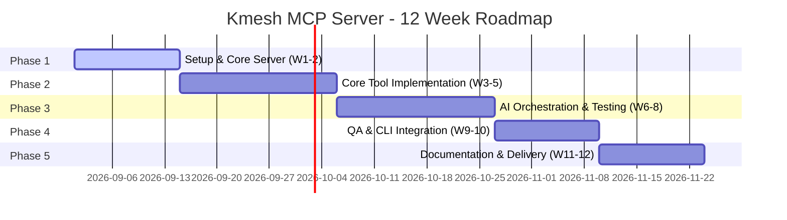

## Proposal for AI-Native Kmesh Service Mesh Management via MCP Server

Upstream issue: <https://github.com/kmesh-net/kmesh/issues/1800>

### Summary

- **Description:** Build a Model Context Protocol (MCP) server that exposes Kmesh's capabilities as callable tools for AI agents (Claude, Cursor, GitHub Copilot). The MCP server acts as a middle layer between AI tools and Kmesh infrastructure, enabling natural language queries like "What services are running?" or "Why is service A not reaching service B?" instead of requiring users to learn complex `kmeshctl` commands, xDS APIs, and eBPF internals.
- **The Problem:** Right now, diagnosing issues within the Kmesh data plane requires users to navigate complex `kmeshctl` commands, understand low-level eBPF internals, and parse through large xDS configuration dumps. This manual workflow creates a steep learning curve and diverts developer focus away from core tasks.
- **The Goal:** To enable natural language observability. Instead of manually correlating pod IPs and routing tables, users can ask high-level questions. The AI will autonomously fetch, filter, and analyze the required data from Kmesh to provide an immediate root-cause analysis.

### Motivation

- Service meshes are inherently complex, and Kmesh's high-performance eBPF-based architecture means debugging often involves kernel-level data. When developers encounter issues, manually fetching data from eBPF maps and parsing massive JSON payloads is tedious.
- By integrating an AI-native MCP server, we dramatically reduce the Mean Time To Resolution (MTTR) for debugging. The AI can autonomously chain tools—finding the right pods, extracting internal data, and synthesizing the results—all in the background.
- Automating this context-gathering phase empowers both novice and experienced users to interact with Kmesh more intuitively, without sacrificing the security or performance of the data plane.

#### Expected Outcomes

- **MCP Server** — Go-based, 10 core tools, MCP v1.0+ compliant (HTTP/SSE transport), under `mcp/` directory.
- **Integration** — Makefile targets (`make mcp-server`, `make mcp-test`, `make mcp-image`), container image creation.
- **Testing** — Unit tests (>80% coverage), integration tests, E2E tests, MCP protocol compliance tests.
- **Documentation** — User guide, developer guide (architecture + adding new tools), AI client setup examples (Claude Desktop, Cursor, Copilot).
- **Community** — Blog post on kmesh.net, demo video showing AI agents interacting with Kmesh, community meeting presentation.
- **Stretch Goals** — 5 additional tools (total 15), read-write mode with safeguards, `kmeshctl mcp serve` subcommand, MCP resource templates.

#### Non-Goals

- Modifying the core eBPF data plane or introducing new networking paradigms into Kmesh.
- Exposing mutating operations (e.g., updating configurations or deleting pods). The initial release will strictly enforce a **Read-Only** boundary to guarantee cluster safety.

### Kmesh CodeBase Analysis & Integration Points

To seamlessly integrate the MCP server, we will interact with specific components of the existing Kmesh architecture:

1. **Kmesh Daemon (`daemon/`)**: The core process running as a DaemonSet. The MCP server will query the daemon to understand the lifecycle and current state.
2. **eBPF Data Plane (`bpf/`)**: The heart of Kmesh. The server will fetch states of both Kernel-Native Mode and Dual-Engine Mode by extracting data from eBPF maps.
3. **Status Server (`pkg/status/`)**: The internal HTTP server listening on `localhost:15200`. This will be our primary data source. The MCP tools will securely route requests to endpoints like `/version`, `/debug/config_dump`, and `/authz`.
4. **CLI Utilities (`ctl/`)**: The MCP server will reuse the robust `setupPortForward` logic found in `kmeshctl` to securely tunnel requests into the daemon pods without exposing new Kubernetes services.

### Proposal Details

#### 1. AI Tool Chaining & Context Flow

Unlike a web UI where a user clicks around, an MCP server lets the AI find information on its own. We do this by connecting tools together (a concept called **Tool Chaining**).

**The Two-Step AI Workflow:**
To get data from Kmesh, the AI needs to follow two simple steps:

1. **Find the Pods:** Look at the cluster to find all running `kmesh-daemon` pods.
2. **Get the Data:** Ask a specific pod for its internal data (like eBPF maps or xDS configs).

Because all Kmesh data belongs to a specific pod, the AI can take the pod name from the first step and automatically pass it to the next tool. This means the AI can dig deep into node data without asking the human user to find or copy-paste pod names.

**Here is an example of how the AI will use the tools:**

- `list_daemon_pods`: First, the AI runs this tool to get a list of all active kmesh-daemon pods.
- `get_bpf_maps`: Once the AI picks a pod to check, it passes the `podName` into this tool to see the eBPF routing data for that node.
- `config_dump`: If the eBPF data looks correct but there is still a problem, the AI can pass the exact same `podName` into the xDS tool to check Envoy configurations.

By designing the tools this way, the AI can independently solve complex mesh problems from start to finish.

**Architecture Diagram:**



#### 2. Technical Implementation Blueprint

The development of each tool follows a strict pipeline ensuring type safety, security, and LLM context optimization.

**A. Data Model & Initialization:**
We will define Go structs decorated with `jsonschema` tags. The `mcp-go` SDK automatically parses these to generate the exact prompt instructions the LLM requires.

```go
import (
    "github.com/mark3labs/mcp-go/mcp"
    "github.com/mark3labs/mcp-go/server"
)
var mcpServer = server.NewMCPServer("Kmesh-MCP-Server", "1.0.0")

// BpfMapDumpRequest defines the input schema for the get_bpf_maps tool.
type BpfMapDumpRequest struct {
    PodName   string `json:"podName" jsonschema:"description=Name of the kmesh-daemon pod"`
    Namespace string `json:"namespace,omitempty" jsonschema:"description=Namespace of the pod"`
}
```

**B. Secure API Wiring (Port-Forwarding):**
To fetch data without compromising security, we will implement a secure tunnel mechanism directly mimicking `kmeshctl`.

```go
// fetchDaemonStatus reuses kmeshctl's internal port-forwarding logic
func fetchDaemonStatus(ctx context.Context, podName, endpoint string) ([]byte, error) {
    localPort, err := setupPortForward(ctx, podName, "kmesh-system", 15200)
    if err != nil {
        return nil, fmt.Errorf("port-forward failed: %v", err)
    }
    url := fmt.Sprintf("http://localhost:%d/debug/%s", localPort, endpoint)
    resp, err := http.Get(url)
    if err != nil {
        return nil, err
    }
    defer resp.Body.Close()
    return io.ReadAll(resp.Body)
}
```

**C. Tool Execution & Context Management:**
Raw xDS and eBPF dumps can easily exceed an LLM's context window. Instead of simply "aggressively stripping boilerplate", the MCP server will explicitly limit the number of returned entries (e.g., maximum 500 routes or map entries). If a dataset exceeds this limit, the server will safely truncate the array and append a clear `... [WARNING: TRUNCATED due to length. X items omitted. Use specific filters to drill down]` message at the end of the JSON payload. This ensures the AI is fully aware that data was intentionally omitted, preventing the truncation from being mistakenly diagnosed as a missing route or endpoint during troubleshooting.

```go
// HandleBpfDump is the main entrypoint when the AI invokes the bpf maps tool.
func HandleBpfDump(ctx context.Context, req mcp.CallToolRequest) (*mcp.CallToolResult, error) {
    podName, ok := req.Arguments["podName"].(string)
    if !ok {
        return mcp.NewToolResultError("podName argument is missing or invalid"), nil
    }
    
    rawData, err := fetchDaemonStatus(ctx, podName, "bpf/kmesh/maps")
    if err != nil {
        return mcp.NewToolResultError(err.Error()), nil
    }
    
    // (Truncation logic applied here)
    res := fmt.Sprintf("Kmesh BPF Map Dump Results:\n%s", string(rawData))
    return mcp.NewToolResultText(res), nil
}
```

**D. Tool Registration & Transport:**
The filtered tool handlers are bound to the SSE transport server, instantly broadcasting their availability to connected AI clients.

```go
// RegisterToolsAndServe defines the available MCP tools and mounts the HTTP transport.
func RegisterToolsAndServe() {
    tool := mcp.NewTool("get_bpf_maps",
        mcp.WithDescription("Retrieves the current eBPF map state from a specific Kmesh daemon pod"),
        mcp.WithString("podName", mcp.Required(), mcp.Description("Target daemon pod name")),
    )
    
    // Bind the tool handler to the server instance
    mcpServer.AddTool(tool, HandleBpfDump)
    
    // MCP officially recommends SSE (Server-Sent Events) for remote network connections
    sseServer := server.NewSSEServer(mcpServer)
    log.Println("Kmesh MCP Server running on :8080...")
    if err := sseServer.Start(":8080"); err != nil {
        log.Fatalf("mcp server crashed: %v", err)
    }
}
```

**Development Lifecycle Diagram:**

```mermaid
flowchart LR
    Start(["Start Development"]) --> P1
    
    subgraph P1 ["Phase 1: Implementation & Integration"]
        direction LR
        S1["Step 1: Data Model<br>(Go structs & schemas)"] --> S2["Step 2: API Wiring<br>(Port-forwarding)"]
        S2 --> S3["Step 3: Data Formatting<br>(Parse & Filter)"]
        S3 --> S4["Step 4: Tool Registration<br>(mcp.AddTool)"]
    end
    
    P1 --> P2
    
    subgraph P2 ["Phase 2: Testing & Deployment"]
        direction RL
        S5["Step 5: Error Handling<br>(Catch network issues)"] --> S6["Step 6: Security Checks<br>(Read-only enforcement)"] --> S7["Step 7: Unit Testing<br>(Mock responses)"] --> S8["Step 8: Quality Assurance<br>(Claude/Cursor E2E)"]
    end
    
    P2 --> Finish(["Tool Implementation Complete"])
```



### Implementation Timeline (12 Weeks)

The project execution is divided into 5 distinct phases over a 12-week period.



#### 🏗️ Phase 1: Environment Setup & Core Server Foundation (Weeks 1-2)

- Establish a local Kubernetes test cluster (Kind/Minikube) and deploy Kmesh.
- Scaffold the Go-based MCP server using the official `mark3labs/mcp-go` SDK.
- Implement the HTTP + SSE transport layer and validate internal API wiring (port-forwarding).

#### 🛠️ Phase 2: Core Tool Implementation (Weeks 3-5)

- Build cluster discovery tools: `get_version`, `list_daemon_pods`, and `get_daemon_health`.
- Build Status Server tools: `config_dump`, `get_bpf_maps`, `get_logger_levels`, and `get_authz_status`.
- Build K8s API tools: `list_waypoints`, `get_waypoint_status`, and `get_mesh_namespaces`.

*Core Tools (10):*

| #  | Tool                  | Input                                                    | Data Source                    | Existing Code Reference               |
|----|-----------------------|----------------------------------------------------------|--------------------------------|---------------------------------------|
| 1  | `get_version`         | optional `pod_name`                                      | `/version` endpoint            | `ctl/version/version.go`              |
| 2  | `config_dump`         | `mode` (kernel-native\|dual-engine), optional `pod_name` | `/debug/config_dump/*`         | `ctl/dump/dump.go`                    |
| 3  | `get_bpf_maps`        | `mode`, optional `pod_name`                              | `/debug/config_dump/bpf/*`     | `pkg/status/status_server.go:151-204` |
| 4  | `list_waypoints`      | optional `namespace`, `all_namespaces`                   | Kubernetes Gateway API         | `ctl/waypoint/waypoint.go:401-468`    |
| 5  | `get_waypoint_status` | optional `namespace`                                     | Kubernetes Gateway API         | `ctl/waypoint/waypoint.go:306-357`    |
| 6  | `get_authz_status`    | optional `pod_names[]`                                   | `/authz` GET                   | `ctl/authz/authz.go:212-248`          |
| 7  | `get_daemon_health`   | optional `pod_name`                                      | `/debug/ready`                 | `pkg/status/status_server.go`         |
| 8  | `get_logger_levels`   | `pod_name`, optional `logger_name`                       | `/debug/loggers` GET           | `ctl/log/log.go:90-112`               |
| 9  | `list_daemon_pods`    | optional `namespace`                                     | Kubernetes API                 | `ctl/utils/utils.go`                  |
| 10 | `get_mesh_namespaces` | none                                                     | Kubernetes API (label check)   | `ctl/waypoint/waypoint.go:597-617`    |

*Clarifications on tool behavior:*

- **Mode Selection:** For `config_dump` and `get_bpf_maps`, if the requested mode is unavailable on the target daemon, the tool will return an explicit MCP ToolError.
- **Auto-Discovery:** If `pod_name` is omitted, the server automatically queries the Kubernetes API and selects a single active `kmesh-daemon` pod in the `kmesh-system` namespace.

#### 🧪 Phase 3: AI Orchestration & Testing (Weeks 6-8)

- Implement robust error handling to gracefully catch malformed AI inputs.
- Write unit tests for all 10 core tools utilizing mocked HTTP responses (Target: >80% coverage).
- Locally connect Claude Desktop / Cursor to validate Tool Chaining and refine JSON schemas for better AI prompt understanding.

#### 🔍 Phase 4: Testing & Quality Assurance (Weeks 9-10)

- Develop 5 additional stretch tools (e.g., IPsec status, connectivity diagnosis).
- Implement the `kmeshctl mcp serve` Cobra subcommand for seamless CLI integration.
- Execute end-to-end smoke tests to validate that the SSE transport server correctly streams JSON-RPC responses.

#### 🚀 Phase 5: Documentation & Final Delivery (Weeks 11-12)

- Create comprehensive user and developer guides, including setup instructions for various AI clients.
- Produce a demo video showcasing an AI autonomously debugging a complex Kmesh routing issue.
- Publish a detailed blog post on `kmesh.net` and package the server for upstream distribution.
